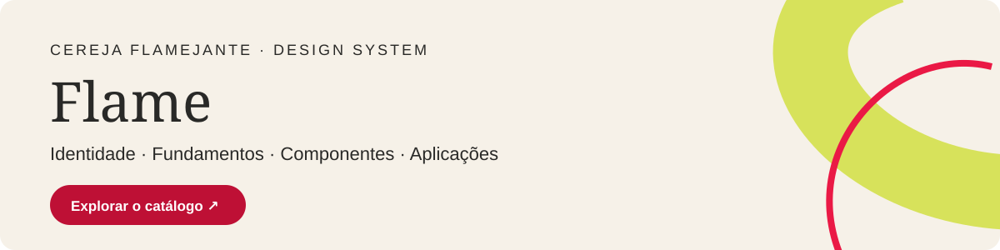

# Cereja Knowledge System

**Núcleo is the canonical knowledge system for Cereja Flamejante.**

Cereja is about **technology, culture, work and the strange things that happen when they meet**.

Núcleo keeps the semantic side of that system explicit: what Cereja knows, what is evidence, what is interpretation, what has become a thesis, what is historical publication, what is still provisional and which source wins when context conflicts.

Its visual counterpart is [**Flame**](brand/flame/README.md), the Cereja Design System.

## The Cereja system

```text
NÚCLEO
meaning · evidence · voice · thesis · context
        +
FLAME
identity · UI · motion · accessibility
        ↓
CEREJA EDITORIAL ENGINE
routing · composition · channel evals · human approval
        ↓
PUBLICATIONS / EXPERIENCES
```

Núcleo does not decide visual treatment from content alone. Flame does not invent meaning or claims to satisfy a layout. The Editorial Engine composes from both.

## Knowledge architecture

```text
SPEC
→ CONCEPTS
→ DECISIONS + EVIDENCE
→ THESIS STATE
→ VIEWS
→ APPLICATIONS
```

Main domains:

```text
brand/
worldview/
editorial/
audience/
thesis-graph/
evidence/
references/
consulting/
offers/
projects/
archive/
governance/
```

## Operating rules

A published newsletter is **historical evidence**, not automatically current truth.

A public reference records **provenance and influence**, not the full competitive research notebook.

An external skill is an **execution asset**, not canonical authority.

Generated language does not become Kell's opinion or a Cereja thesis without human approval.

## Flame

[](https://cerejaflamejante.com.br/flame/)

[Open the visual catalogue](https://cerejaflamejante.com.br/flame/): identity, foundations, components and applications.


[Flame](brand/flame/README.md) is the visual and interaction source of truth for Cereja.

It covers:

- design principles;
- color, typography, spacing and semantic tokens;
- components and editorial patterns;
- purposeful motion;
- responsive behavior;
- multimodal accessibility;
- cognitive/sensory accessibility;
- QA and governance;
- optional traceability for high-impact design decisions.

Its current accessibility principle is:

> **Expressão visual está no nosso DNA. Acessibilidade também. Queremos movimento, surpresa e personalidade sem sacrificar foco, orientação, compreensão, conforto sensorial ou a capacidade de concluir uma tarefa. Cool is for everyone.**

## Agentic execution layer

The canonical cross-repository control plane and Agent Registry live in [eusouakell/agentic-factory](https://github.com/eusouakell/agentic-factory).

Núcleo and Flame remain domain authorities. Factory agents may consume their contracts, but may not silently redefine canonical knowledge, thesis state, brand, typography, motion families or accessibility rules.

Examples:
- Flame UI Composer executes under Flame;
- Motion Web Director and Editorial Typography Director propose changes under Flame governance;
- Research Synthesist may contribute evidence, but cannot make a Cereja thesis canonical;
- human gates remain required for canonical domain changes.

## External work and attribution

Public external references live under [references/](references/).

The public repo records only what materially informed Cereja and the relevant boundary. Deeper competitive analysis, monetization hypotheses and opportunity mapping are kept in private research.

External skills are reviewed in [governance/skills-curation.md](governance/skills-curation.md).

## Current status

Núcleo and Flame are **V0.x systems under active validation**.

Current gaps include:

- approval and maintenance of voice guidance based on the locally ingested #000–#030 archive;
- voice-calibration approval from a larger sample;
- real publishing cycles through the full Editorial Packet workflow;
- production validation of Flame components;
- controlled experiments on context routing and design traceability.

No measured performance advantage is claimed from architecture alone.

## Start here

- [System specification](SYSTEM-SPEC.md)
- [Núcleo + Flame](brand/systems.md)
- [Flame Design System](brand/flame/README.md)
- [Flame agent-readable contract](brand/flame/DESIGN.md)
- [Editorial architecture](editorial/editorial-architecture.md)
- [Voice and tone from the archive](editorial/voice-and-tone.md)
- [Curation, authorship and quotation decisions](editorial/curation-decisions.md)
- [Archive ingestion coverage](archive/public-inventory.md)
- [Evidence schema](evidence/schema.md)
- [Thesis graph](thesis-graph/README.md)
- [Skills curation](governance/skills-curation.md)
- [Public reference policy](governance/public-reference-policy.md)
- [IP & licensing policy](governance/ip-licensing-policy.md)

## Companion execution layers

- [Cereja Editorial Engine](https://github.com/eusouakell/cereja-editorial-engine) — editorial workflow, composition and publication gates.
- [Agentic Factory](https://github.com/eusouakell/agentic-factory) — bounded specialist agents, control plane and cross-repository authority model.

## Rights

See [RIGHTS.md](RIGHTS.md). Public visibility does not grant a blanket open license to reuse Cereja's original systems, methodology or design-system specifications.

## Content Design

[Princípios de Content Design](editorial/content-design.md) e [linguagem simples](editorial/linguagem-simples.md) são fontes do Núcleo para execução editorial e de interface. A skill aplica essas orientações; fluxos de Instagram e composição visual mantêm escopo próprio.
